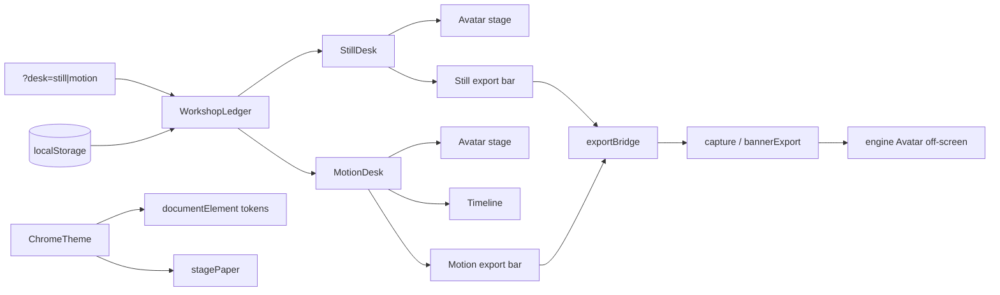

# Studio split — candidate 4 (Diptych Latch)

## Problem

Grok_bot today is one studio with one look singleton (`customise.ts`), one pose ref (`App.vue`), and one montage ref (`Timeline.vue`). Still and video exports read the same values; navigation is scroll-to-section anchors, not pages; theme is light-only hardcoded tokens. The redesign must give Image and Video independent shape/colour/expression (video also owns pose and montage), a discoverable mode switch, and first-class light/dark chrome — without breaking bloub parity budgets, golden `paperFill` snapshots, or export matte (`BLANC`). The non-obvious part is that three paint layers (app chrome, avatar stage paper, export flatten) must stay decoupled: dark chrome cannot leak into `ouvreCycle` or goldens, yet the live preview must not show grey eye holes on a dark stage.

## Usage (caller's view)

### Quickstart

```ts
// main.ts — bootstrap once
import { mountDiptychStudio } from '@/studio/diptych'

mountDiptychStudio('#app')
```

`mountDiptychStudio` wires theme on `document.documentElement`, creates the ledger with two workshops restored from `localStorage`, reads `?desk=still|motion` (default `still`), and mounts `DiptychShell.vue`. Hash `#etat=` remains video-only for pose share links.

### Call site 1 — App shell reads active workshop, never singletons

```vue
<script setup lang="ts">
import { computed } from 'vue'
import { useDiptych } from '@/studio/diptych'
import StillDesk from '@/studio/StillDesk.vue'
import MotionDesk from '@/studio/MotionDesk.vue'
import LatchRail from '@/studio/LatchRail.vue'

const { activeKind, ledger, chrome } = useDiptych()
const desk = computed(() =>
  activeKind.value === 'still' ? StillDesk : MotionDesk,
)
</script>

<template>
  <div class="diptych" :data-desk="activeKind">
    <LatchRail v-model:kind="activeKind" :ledger="ledger" :chrome="chrome" />
    <component :is="desk" :workshop="ledger[activeKind]" />
  </div>
</template>
```

`StillDesk` and `MotionDesk` are **not** mounted together (`v-if` swap). Each receives a closed `Workshop` value; pickers bind only to that object. Switching the latch does not copy state across workshops.

### Call site 2 — Export from the active desk in one call

```ts
import { exportWorkshop } from '@/studio/exportBridge'
import { stillIntent, motionIntent } from '@/ui/intent'

// StillDesk export bar
await exportWorkshop(ledger.still, stillIntent('png'), { svg: stageSvg })

// MotionDesk export bar — montage or pose resolved inside intent
await exportWorkshop(
  ledger.motion,
  motionIntent('mp4', { source: 'cycle', cycle: workshop.montage.active }),
  { svg: stageSvg, signal },
)
```

`exportWorkshop` assembles shape/colour/expression from the passed `Workshop`, applies `BLANC` for encoders, and never reads `customise.ts`. Callers do not touch storage keys or `NomStocke`.

### Call site 3 — Theme toggle (orthogonal to workshops)

```ts
import { useChromeTheme } from '@/studio/chrome'

const { theme, setTheme, stagePaper } = useChromeTheme()
// stagePaper feeds Avatar :paper on the live stage only
setTheme('dark') // persists grok_bot:chromeTheme, sets data-chrome-theme on <html>
```

Banner plate ink (`plates.ts` `encre`) is untouched; app theme only affects chrome tokens and optional stage paper.

## Shape

### Load-bearing decisions

**1. Closed `Workshop` capsules (discriminated union).** `StillWorkshop` and `MotionWorkshop` are distinct types sharing `LookBundle` but only motion carries `pose` and `montage`. TypeScript prevents assigning motion montage to still export. Independent configs are structural, not convention (`per encode-lessons-in-structure`).

**2. `WorkshopLedger` — one deep module.** Owns both workshops, namespaced persistence (`forme:still`, `cycles:motion`, …), validation at write boundaries, and `switchDesk(kind)` which updates `?desk=` via `history.replaceState` without remounting theme. Callers import `useDiptych()`; they never coordinate twin stores (`per boundary-discipline`, `per interface depth`).

**3. Exclusive desk mount (`v-if`).** Only one desk DOM at a time avoids duplicate `#studio` ids, friction-probe ambiguity, and accidental cross-writes. Layout padding drops the 14rem timeline gutter on Still via `data-desk` CSS, not duplicated page components (`per subtract-before-you-add`).

**4. Latch Rail navigation — non-generic UX.** A two-chamber physical latch in the top bar: sliding gate reveals Still or Motion label; the recessed chamber shows a 24px live glyph of the *inactive* workshop's bot (shape silhouette + colour dot). Tap chamber or drag gate to switch. Not a tab strip; not hamburger pages. Mobile keeps latch in the header; export stays in-desk (`per product ask`).

**5. Query `?desk=` not Vue Router.** Deep-linkable mode without a router dependency or dev-server history fallback config. Orthogonal to `#etat=` pose hash on Motion. `switchDesk` is idempotent (`per make-operations-idempotent`).

**6. Three paint layers explicit in types.**

| Layer | Type / constant | Rule |
| --- | --- | --- |
| Chrome | `ChromeTheme` → CSS tokens on `[data-chrome-theme]` | Light/dark app shell only |
| Stage paper | `stagePaper(theme)` → `Avatar :paper` | Theme-derived on live preview; may differ per desk policy |
| Export matte | `BLANC` in `ui/export.ts` | Never theme-derived; `ouvreCycle` unchanged |

Goldens keep `DEFAULT_PAPER` in engine; stage paper override does not touch `picture.ts` recordings (`per HOW gotchas`).

**7. Engine reuse.** `Avatar.vue`, `rendAt`, `capture.ts`, `intent.ts`, `bannerExport.ts` stay. `exportBridge.ts` is the single adapter from `Workshop` → existing export functions. `PhantomStudio` splits into `StillDesk` / `MotionDesk` shells reusing picker subcomponents (`CustomisePanel` bands, orbital CSS).

**8. Motion-only Timeline.** `MotionDesk` mounts `Timeline` fixed bottom; `StillDesk` omits it and uses compact page padding. Pose hash read/write moves into `MotionWorkshop` lifecycle, not `App.vue` globals.

**9. Per-workshop banner.** `LookBundle` does not include banner; each `Workshop` owns `banner: BannerChoice` with keys `fond:still` / `fond:motion`. Maximises independence; shared banner is a one-line ledger merge if product reverses (`per separate-before-serializing-shared-state`).

### Data flow



### Interface depth

Public surface: `mountDiptychStudio`, `useDiptych`, `useChromeTheme`, `exportWorkshop`, `LatchRail` props. Hidden inside ledger: key namespacing, `NomStocke` tuple extension, look validation, montage JSON parse, hash echo guard for motion pose, export payload assembly. Pickers see only `v-model` slices on their workshop — no `customise.ts` import.

### Deliberately not done

- No Pinia, no Vue Router.
- No keep-alive dual mount.
- No theme on export encoders or banner plates.
- No port of decorative `videoSource` radio (`per HOW`).

## Synthesis decision

Filled by arena later.

## Tradeoffs accepted

- We accept `?desk=` query parsing instead of path routes in exchange for zero new routing dependency and clean coexistence with `#etat=` pose links.
- We accept per-workshop banner storage in exchange for true independence; users re-pick banner when switching desks unless we later add an explicit "sync banner" action.
- We accept `v-if` desk swap (no cross-desk hover preview) in exchange for single DOM, correct friction probes, and no duplicate element ids.
- We accept a deeper `WorkshopLedger` module in exchange for a thin shell and one-call export; ledger unit tests replace scattered persistence specs.
- We accept retokenizing shadow literals (`rgb(0 0 0 / …)`) into `--shadow` / `--wash` in exchange for dark chrome that is not invisible hairlines.

## Alternatives considered

**Vue Router `/image` + `/video`.** Deeper linking and familiar IA, but adds dependency, history fallback, and route-view lifecycle complexity for two pages that share 80% of picker UI. Exposes route params and navigation guards to callers; hides less than `?desk=` + ledger because export still needs workshop identity passed explicitly. Lost on fit-to-existing no-router baseline.

**Twin singleton modules (`customiseStill.ts` / `customiseMotion.ts`).** Minimal diff from today, but duplicates the customise pattern, leaks storage key strings to every importer, and does not encode montage/pose ownership — callers must remember which singleton pairs with Timeline. Shallow modules per red-flag screen.

**Single store with `mode: 'still' | 'motion'` field on shared look.** One object, two key prefixes switched at runtime — looks independent but invites accidental shared references (one `ref` reassigned on switch stomps the other). Rejected because independence must be types, not runtime branch.

## Open questions and risks

- Should stage paper follow chrome (dark holes) or stay canonical `#f5f5f4` on dark chrome for bloub-like preview? Types allow either via `stagePaper` policy flag; product should pick before polish.
- Migration: on first load, copy legacy `forme`/`couleur`/`expression` into both workshops or only `still`? Ledger can seed motion from still once; needs a decision.
- `App.spec.ts` and `frictionProbe` must scope to `[data-desk="…"]` — do we update probes in the same PR or follow-up?
- i18n: `app.tagline` and dead `flow.*` keys imply a three-step video wizard; new copy for two-desk IA may move friction score — acceptable?
- Golden snapshots are unaffected by chrome theme, but manual visual review of dark chrome + stage paper combo is still needed.

## Next implementation step

Extend `NOMS` in `stockage.ts`, implement `WorkshopLedger` with restore/persist for `still` and `motion` look keys, and prove independence with a `persistence.spec.ts` case that writes shape on still and asserts motion unchanged.
