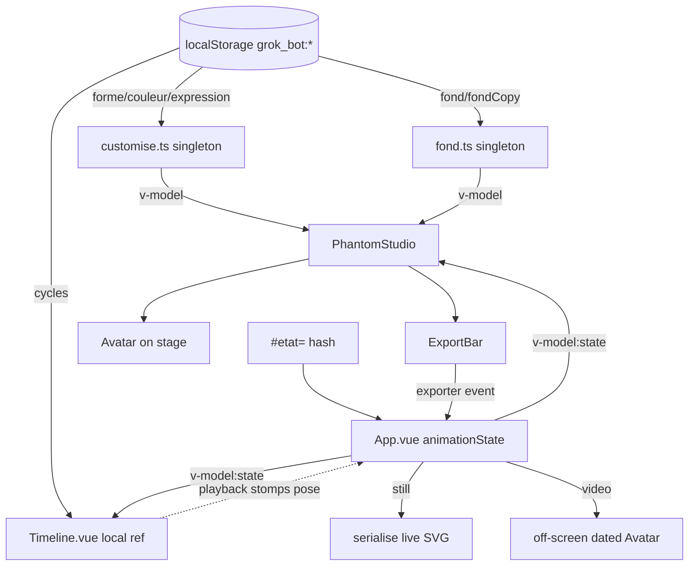

# How Grok_bot owns still vs video config, navigation, and theme

Synthesis of three explorer passes, re-checked against code on branch `feat/banner-backgrounds`.

## Overview

There is no "image mode" and no "video mode" in this app. There is **one studio page, one bot, one set of pickers**, and a fork that happens only at the moment you press an export button. `App.vue` mounts a single `PhantomStudio` (the whole visible studio: stage, picker toolbar, export bar) plus a single always-on `Timeline` fixed to the bottom of the viewport. Everything the user picks — shape, colour, expression, backdrop — feeds both the PNG you download and the MP4 you download, because there is only one copy of each value in the process.

Three separate ownership stories are tangled together here, and a redesign has to unpick all three:

1. **Configuration** lives in module-level Vue refs — `src/customise.ts` for shape/colour/expression, `src/fond.ts` for banner, `App.vue`'s `animationState` for pose — each persisted to its own `localStorage` key. These are ES-module singletons, not stores you can instantiate twice.
2. **Navigation** is not navigation. The four header links (`studio`, `customise`, `settings`, `about`) call `scrollIntoView` and explicitly `@click.prevent` so they never touch the URL. The hash is reserved for something else entirely: `#etat=<pose>` pose sharing.
3. **Theme** does not exist. `main.css` declares `color-scheme: light` and five tokens on `:root`. There is no dark palette, no theme storage key, no theme toggle.

The interesting constraints are not in any one of these; they're in the seams. Notably: the page background `#f5f5f4` in `main.css` and the avatar's `DEFAULT_PAPER` `#f5f5f4` in `engine/avatar.ts` are the same colour by coincidence, from two unrelated sources, and 27 committed golden snapshots pin the second one. Dark mode walks straight into that.

## Key Concepts

**Look vs pose vs montage.** Three different kinds of state with three different owners.

- *Look* = shape + colour + expression. Owned by `src/customise.ts`. Persisted to keys `forme`, `couleur`, `expression`.
- *Pose* = one `AnimationState` (`Idle`, `Comet`, …). Owned by `App.vue`'s `animationState` ref. Persisted only into `location.hash`, never `localStorage`.
- *Montage* = an ordered list of `Block`s (pose + duration) grouped into named `Cycle`s. Owned by `Timeline.vue`'s local `cycles` ref. Persisted to key `cycles`.

**Still vs video is an export-time fork, not a mode.** `ExportBar.vue` emits a single `exporter` event with an `action` id. `App.vue`'s `surExport` switches on it:
- `png` / `svg` → serialise the *live on-screen SVG* via `exporte()` in `ui/capture.ts`.
- `gif` / `mp4` → mount a *second, off-screen* `Avatar` in a throwaway Vue app (`ouvreCycle`) and step it frame by frame with `rendAt(t, blocks)`.
- `banner-png` / `banner-mp4` → same split, on the banner canvas in `ui/bannerExport.ts`.

**Pose-as-video is synthesised, not recorded.** `cycleForSource()` in `ui/intent.ts` turns a bare pose into a three-block cycle (`Idle 0.4s → pose 1.2s → Idle 0.4s`) via `poseCycle()`. The Timeline is not consulted for this. But `App.vue` guards it anyway — see Gotchas.

**Preview vs commit.** `PhantomStudio` keeps `previewShape` / `previewExpression` / `previewState` refs that shadow the models on `pointerover` and clear on `pointerleave`. Hover changes what's rendered; only click writes through the `v-model` to the singleton and therefore to `localStorage`. `App.spec.ts` asserts this explicitly ("previews a shape on pointer hover without writing storage").

**Five different whites.** Understanding theme requires knowing these are five unrelated values, not one token used five ways:

| Paint | Value | Source | Who sees it |
| --- | --- | --- | --- |
| Page canvas | `#f5f5f4` | hardcoded in `main.css :root` | browser chrome background |
| `--paper` | `#ffffff` | token in `main.css` | `.surface` cards, timeline bar, buttons |
| Avatar paper | `#f5f5f4` | `DEFAULT_PAPER` in `engine/avatar.ts` | the fill *behind* the mask — i.e. the eyes |
| Export matte | `#ffffff` | `BLANC` in `ui/export.ts` | flattened under GIF/MP4 frames |
| Banner plate ink | `#fff` / `#111` | `plate.encre` in `ui/plates.ts` | wordmarks on banner backdrops |

Avatar paper reads as "invisible" today only because it equals the page canvas. It is the fill of `<path data-body-paper>`, which the eye ellipses in the mask punch through to reveal.

## How It Works

### Configuration flow

`customise.ts` is the shape to study. It creates three `ref`s at module scope, seeded from `localStorage` through `restaurer()`, and exports them wrapped in writable `computed`s whose setters validate and then `ecris(...)`. Import it twice and you get the same three refs. The only way tests get a fresh copy is `vi.resetModules()`, which `persistence.spec.ts` does in every `beforeEach`.

`App.vue` passes them straight through as `v-model:shape` / `v-model:expression` / `v-model:colour` on `PhantomStudio`, which passes them straight through again to `CustomisePanel`. `PhantomStudio` holds no committed state of its own — only the hover previews and which picker band is open (`field`).

### Pose, hash, and the Timeline stomp

`App.vue` reads `lireHash()` on setup and watches `[animationState, playing]`, writing `#etat=<slug>` or `#etat=<slug>&stop` back via `history.replaceState`. It tracks what it wrote in `ecritParNous` so its own `hashchange` handler can ignore the echo.

`Timeline.vue` receives `state` as a `defineModel`, and *writes to it*. `sample(t)` sets `state.value` to whatever block the playhead is over; the `watch(playing)` handler snaps `state` to the current block on play; `watch(activeId)` snaps it to block 0 when you change cycles. So the timeline is a second writer on App's single pose ref. This is why `PhantomStudio` emits `stop-playing` on every motion or face commit — clicking a pose while playing has to halt the timeline or the timeline immediately overwrites the click.

### Navigation

`App.vue` defines `const SECTIONS = ['studio', 'customise', 'settings', 'about']` and renders `<a :href="#${id}" @click.prevent="aller(id)">`. `aller()` does `getElementById(id).scrollIntoView()` and nothing else. `App.spec.ts` locks this in: after clicking `[data-nav="customise"]`, `location.hash` is still `#etat=orbit&stop`.

The anchor targets are scattered: `#studio` is the `<section>` inside `PhantomStudio`, `#customise` is on `CustomisePanel`, and `#settings` / `#about` are both inside `Settings.vue` (`#about` is an `<h3>`). `#customise` is nested inside `.field.customise`, which is `opacity: 0; pointer-events: none` unless the Shape/Face/Aura toolbar button is toggled on — so that nav link routinely scrolls to an invisible element.

The picker toolbar uses `data-mode="shape|expression|colour|fond|state"` and calls `setField()`, which toggles a single `field` ref. These "modes" are which floating panel is open, nothing more. They are not pages, and the name collision with a future Image/Video "mode" is a trap.

### Theme

There is one stylesheet, `src/assets/main.css`, imported once in `main.ts`. It sets `color-scheme: light`, a hardcoded `background: #f5f5f4` and `color: #1c1917` on `:root`, then five tokens: `--ink`, `--muted`, `--line`, `--paper`, plus two layout values `--rail` and `--chrome`. Every component reads those tokens in scoped CSS. Nothing reads a theme flag, because there isn't one.

The existing precedent for a document-level preference is language: `src/i18n/index.ts` keeps a `langue` computed backed by the `langue` storage key and mirrors it onto `document.documentElement.lang` in a watcher. A theme would slot in alongside it.

Shadows and hairlines are *not* tokenized. `rgb(0 0 0 / …)` appears literally in `Timeline.vue`, `TimelineTrack.vue` (four times, including `background: rgb(0 0 0 / 0.045)` for track fills), `PhantomStudio.vue` (twice), and `CustomisePanel.vue`. Black alpha over a dark surface is invisible; these need `--shadow` / `--wash` tokens before dark mode reads correctly.

## Where Things Live

| Concern | File | Notes |
| --- | --- | --- |
| Look singleton | `src/customise.ts` | `shape`, `colour`, `expression` writable computeds |
| Banner singleton | `src/fond.ts` | `bannerId`, `bannerCopy`, `setBannerCopy` |
| Storage keys | `src/i18n/stockage.ts` | `NOMS` tuple gates the `NomStocke` type; prefix `grok_bot:` |
| Pose + export orchestration | `src/App.vue` | `animationState`, `playing`, `surExport`, `SECTIONS`, `aller` |
| Studio shell / pickers | `src/components/PhantomStudio.vue` | `field`, previews, orbital picker CSS, `svgCourant()` |
| Montage | `src/components/Timeline.vue` | `cycles`, `activeId`, `sample`, `seek`; writes `state` |
| Export UI | `src/components/ExportBar.vue` | emits `{ action, videoSource }` |
| Export intents | `src/ui/intent.ts` | `poseCycle` wrapping, `cycleForSource`, `durationForSource` |
| Export DOM work | `src/ui/capture.ts` | `exporte` (still), `ouvreCycle` / `cycleVersMp4` / `cycleVersGif` |
| Export constants | `src/ui/export.ts` | `BLANC`, `ACTION_BY_ID`, `CYCLE_TAILLE`, `videoPossible` |
| Avatar rendering | `src/components/Avatar.vue`, `src/engine/avatar.ts` | `DEFAULT_PAPER`, `rendAt`, mask/eye geometry |
| Hash schema | `src/engine/hash.ts` | `STATE_SLUGS`, `lireHash`, `ecrireHash` |
| Tokens | `src/assets/main.css` | the entire theme surface, 51 lines |
| Language precedent | `src/i18n/index.ts` | `documentElement.lang` watcher |
| Banner plates | `src/ui/plates.ts`, `src/ui/toile.ts` | `encre: 'sombre' \| 'clair'`, `fondHex` |
| Friction ruler | `src/ui/friction.ts`, `src/ui/frictionProbe.ts` | probes a mounted wrapper by `data-*` selectors |
| Parity budgets | `src/testing/visual/parity/idle.spec.ts` | eye-geometry MAE only, no colour |
| Golden snapshots | `src/testing/visual/__golden__/` | 27 files pin `"paperFill": "#f5f5f4"` |

## Gotchas

**The `videoSource` radio group is decorative.** `ExportBar.vue` keeps a `videoSource` ref and renders a `role="radiogroup"` for pose vs cycle inside `
`. That ref is never read when emitting. Every button calls either `exporterPose(...)` (hardcodes `videoSource: 'pose'`) or `exporterCycle(...)` (hardcodes `'cycle'`). Selecting the radio changes only `aria-checked` and a CSS class. Splitting Image/Video is a good moment to delete it rather than port it.

**Video export throws without a mounted Timeline — but doesn't need one.** In `surExport`, both the banner branch and the montage branch open with `const cycle = cycleActif.value; if (!cycle) throw new Error('no montage')`. `cycleActif` is `timeline.value?.cycle ?? null`, so it is `null` exactly when `Timeline` is unmounted. For the *pose* source, `cycle` is then used for nothing: `cycleForSource` synthesises the blocks and the filename comes from `source.state`. The guard is over-broad. If the Video page mounts Timeline and the Image page doesn't, nothing breaks; if you ever want pose-video from a Timeline-less page, this guard is the only thing in the way.

**Avatar `paper` is already a prop — but its default is snapshot-locked.** `Avatar.vue` accepts `paper?: string` and `ouvreCycle()` already overrides it to `#ffffff` for GIF/MP4 (so the eyes match the matte instead of showing stone-grey holes). So per-instance repainting is a supported path. What you cannot do is change `DEFAULT_PAPER` in `engine/avatar.ts`: `picture.ts` records `paperFill: frame.paper` into the golden JSON and 27 committed goldens assert `#f5f5f4`.

**Dark mode's real problem is the eye holes, not the chrome.** Retokenizing `--ink` / `--muted` / `--line` / `--paper` is mechanical. The live studio avatar renders with `paper = #f5f5f4` and the mask punches the eyes through to reveal it. On a dark page, the eyes become light-grey blobs instead of reading as cut-outs. Fixing that means threading a theme-derived `paper` prop from `PhantomStudio` into the stage `Avatar` only — never into `ouvreCycle`, `bannerExport`, or the default. Whether the bot *should* invert with the theme, or stay canonical-light on a dark stage, is a product decision nobody has made.

**Parity budgets are geometry, not colour.** `idle.spec.ts` locks `IDLE_EYE_CENTRE_MAE_MAX` etc. against a bloub dump of eye centres and radii. A theme change cannot move those numbers. The visual *goldens* are the colour-sensitive artifact, not the parity harness. Worth separating in review: "don't break parity" and "don't break goldens" are different risks.

**Removing the Timeline from an Image page is a layout change, not just a `v-if`.** The bar is `position: fixed; bottom: 0`. Clearance for it is bought twice: `.page { padding: … 14rem }` in `App.vue` and `.stage { min-height: calc(100svh - var(--chrome, 11rem)) }` in `PhantomStudio.vue`, with `--chrome: 11rem` set in `main.css`. Hide the bar without unwinding both and the Image page gets a large dead gap.

**New storage keys need a tuple edit.** `NomStocke` is derived from the `NOMS` literal tuple in `src/i18n/stockage.ts`. `ecris('theme', …)` or `ecris('cycles:video', …)` is a type error until `NOMS` is extended. Two pages writing look state means either two key sets (`forme:image` / `forme:video`) or one namespaced blob — either way, that tuple grows.

**Banner ink is plate-owned and must stay that way.** `plates.ts` gives each plate `encre: 'sombre' | 'clair'` and `fondHex`; `BannerBackdrop.vue` and `toile.ts` both derive wordmark colour from it. A dark app theme must not touch this — the light banner plate has dark ink regardless of what the surrounding app looks like, because the exported banner is the artifact.

**`flow.*` i18n is dead copy from a deleted wizard.** `en.ts` / `fr.ts` / `zh.ts` all carry a `flow` block with `look` / `motion` / `video` and `lookTitle: '1. Choose the look'`. Nothing renders it. It is a three-step *video* wizard, not an Image-vs-Video split, and reusing `flow.video` as a page label would be semantically wrong in three languages at once. Also note `app.tagline` still says "Three steps: pick a look, pick a motion, download the video" — and `frictionProbe`'s `taglineMentionsVideo` flag (weight 1) checks it for `video|gif|mp4|clip`, so rewording it for a two-page IA has a scored consequence.

**The friction harness and `App.spec` assume one of everything.** `probeFriction(wrapper)` queries a mounted wrapper for `[data-export-bar]`, `[data-export="gif"]`, `[data-animations-palette]`, `[data-add]`, `#studio svg[role="img"]` — unqualified, first match wins. `App.spec.ts` similarly asserts `findAll('#studio svg[role="img"]')` has length 1. If both pages mount simultaneously (kept alive rather than swapped), these silently probe the wrong page. If pages swap, the harness needs to know which page it's scoring, since half the flags (`montageLabeled`, `cycleNamed`, `durationShown`) only make sense on Video.

**Duplicate DOM ids.** `#customise`, `#studio`, `#animations` are hardcoded ids inside components. Rendering an Image page and a Video page at the same time duplicates them and breaks both `getElementById` and the `scroll-margin` rules in `main.css`.

## Open questions

These are genuinely undecided in the code; I'm flagging rather than guessing.

- **Routing mechanism.** There is no Vue Router and no Pinia. A path-based route (`/image`, `/video`) composes fine with `#etat=` since they occupy different parts of the URL, but requires a router dependency and dev-server history fallback. An in-app `ref<'image' | 'video'>` avoids both but gives up deep links. Nobody has chosen.
- **What a split *means* for share URLs.** `#etat=` encodes pose only — not shape, colour, expression, or banner. If Image and Video get independent looks, a shared link no longer reproduces what the sender saw, and it already doesn't. Whether to extend the hash schema is open.
- **Shared vs per-page banner.** `fond.ts` is one singleton. Nothing in the code suggests which way this should go.
- **Whether the two pages share pose.** Independent pickers per page is the stated ask, but pose is currently a third thing (App-owned, hash-backed, Timeline-stomped) and the ask doesn't say whether "pose" counts as a picker.
- **Whether dark mode follows `prefers-color-scheme`.** The language code has a precedent for detect-but-don't-persist (`persistence.spec.ts`: "does not persist a detected language"). No equivalent decision exists for theme.
